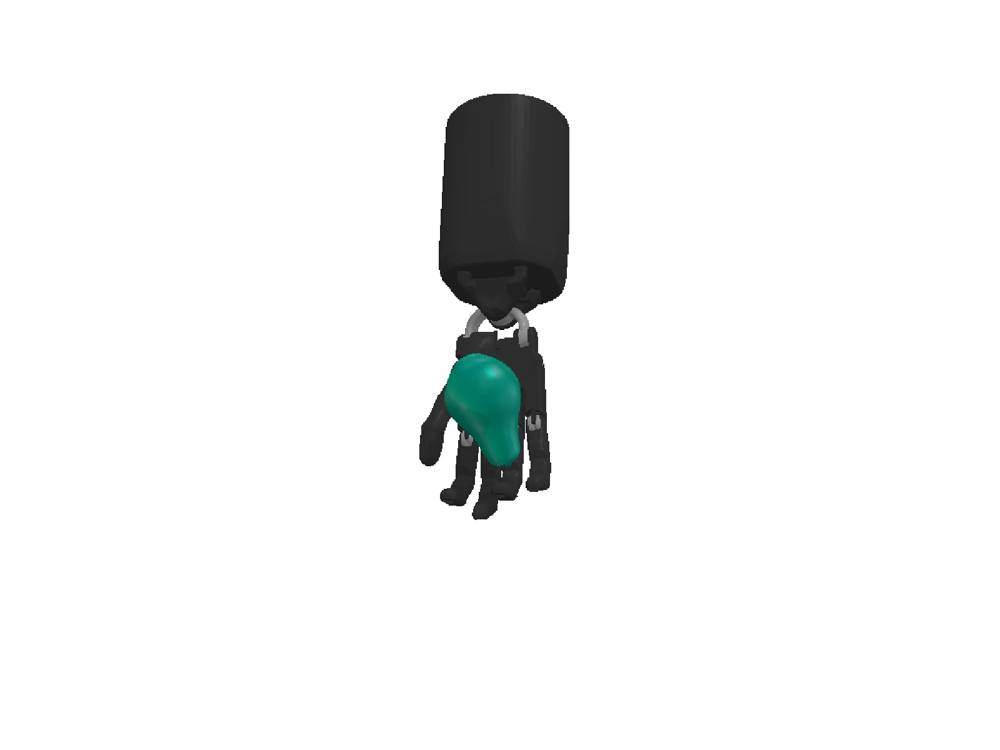
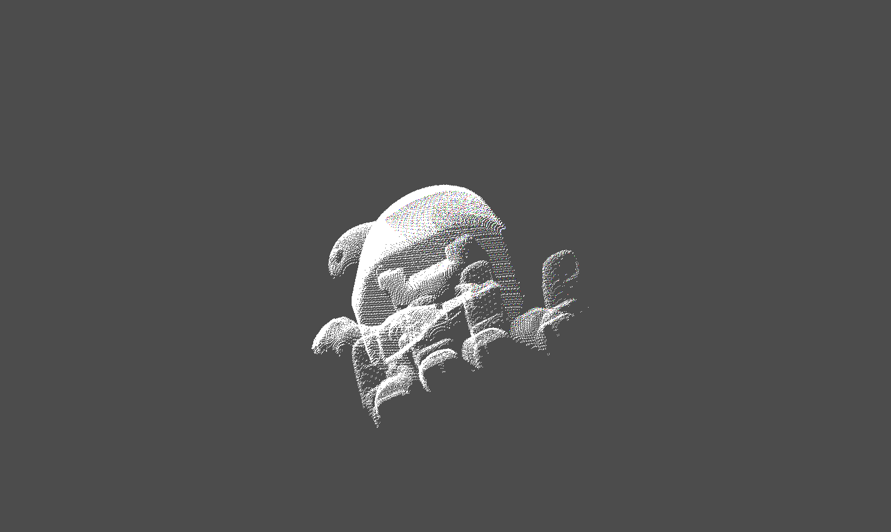
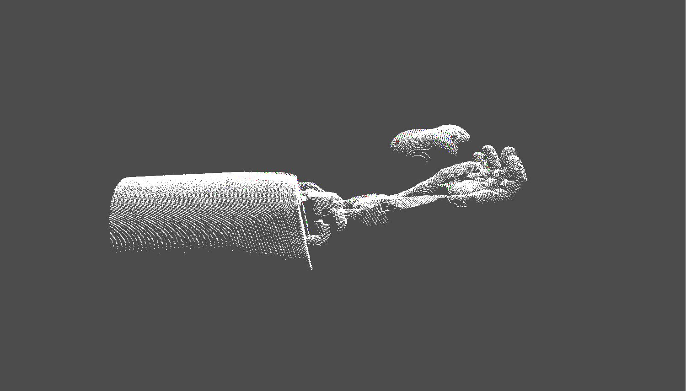
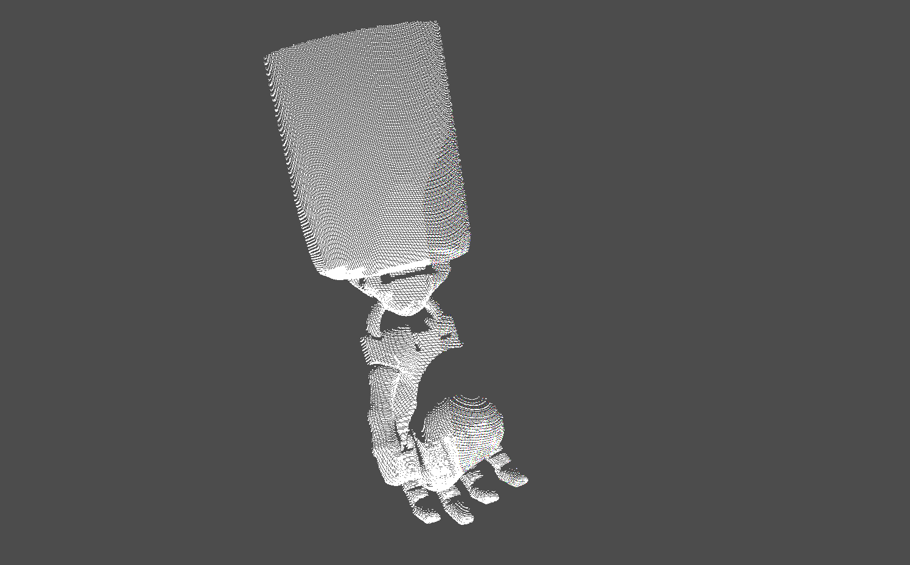
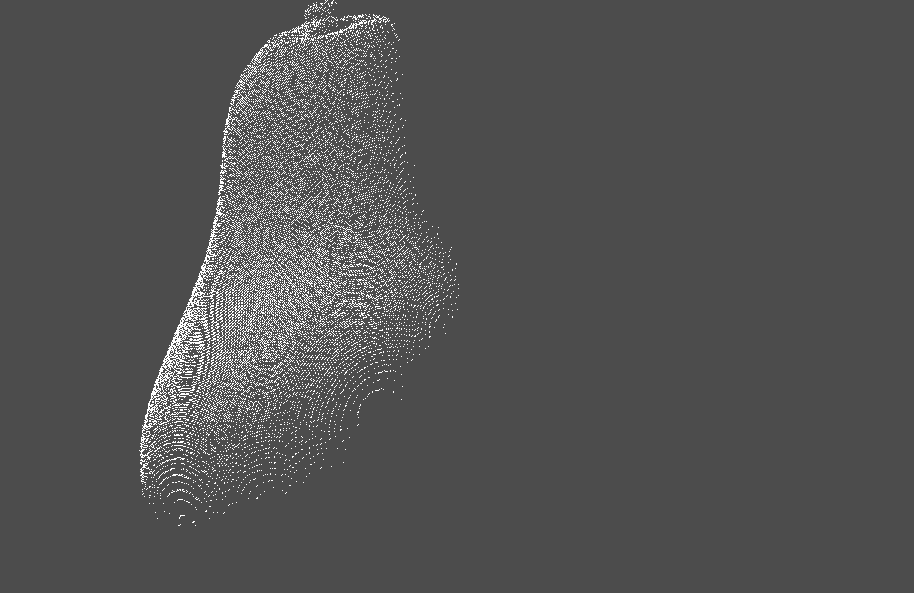
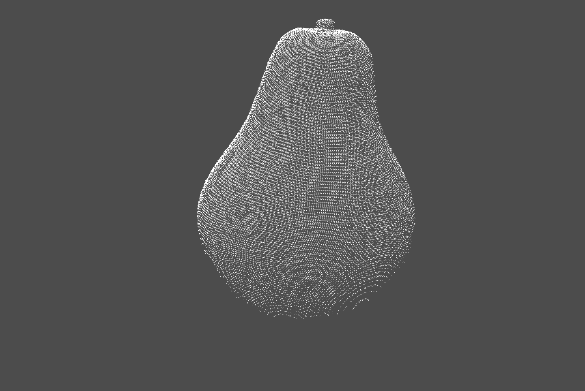
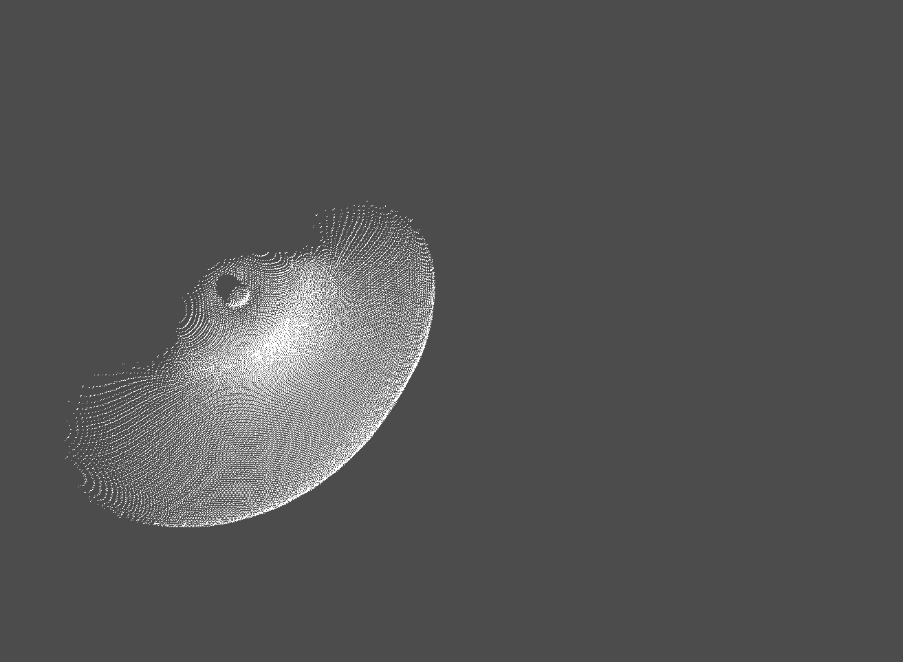

# Geometry-Aware Dexterous Manipulation in PyBullet
## environment

- an environment including arm, hand and food built with [PyBullet](https://pybullet.org/wordpress/)
## point cloud
| | front view | side view | top view |
| :-----: | ----- | ----- | ----- |
| **item on palm** |  |  |  |
| **item** |  |  |  |
## pre-trained pointnet
Below are the classification results on ModelNet with pre-trained pointnet. Some results are not very well for three reasons.
- The point clouds sampled from a single environment have little difference except for rotation, so the train data is limited.
- Training point clouds of chair and table, piano and sink have little difference, pointnet can't classify them well.
- Point clouds of arm and palm effect point clouds of object.

| category | accuracy |
| :-----: | :-----: |
| bathtub | `43.45238095238095%` |
| chair | `0.0%` |
| guitar | `26.686507936507936%` |
| lamp | `5.357142857142857%` |
| monitor | `18.61359126984127%` |
| piano | `1.6666666666666666%` |
| plant | `82.94444444444444%` |
| sink | `7.738095238095237%` |
| table | `2.1825396825396828%` |
| toilet | `3.9473684210526314%` |
## rotation train
Train environments with ddpg algorithm. Rotation training upon environments failed with some reasons.
- Capturing point cloud every step from environment is too slow. Every training episode it takes about `6000 seconds` on capturing point clouds, while [huang](https://github.com/huangwl18/geometry-dex/tree/main) spent about `300 seconds` on obtaining point clouds from mujoco simulator every episode. 
- Point cloud of object above palm has impact on training.
- Rotation difference between object and target is not accuracy, resulting in the reward not increasing.
